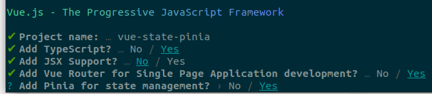

# Vue State using Pinia

Problem we often have is that multiple components share the same state / data. Passing this data from component to component or parent to child can become tedious.

Global state management is a must-have for larger applications. This is where Pinia comes into play.

Bit of a rule is to only use Pinia for application wide state. Don't use it for component specific state.

The standard state management module for Vue2 used to be Vuex. However, it had some complexities and shortcomings. Pinia is now the standard for Vue3 apps.

For this demonstration we will be using the DUST API: [https://dust.devbitapp.be/api](https://dust.devbitapp.be/api). More information about the API can be found at [https://dust.devbitapp.be/docs/api](https://dust.devbitapp.be/docs/api).

DUST is a research project where soil moisture of trees and other parameters are monitored. The API provides a public endpoint for users to monitor a tree at a given location.

## Starting

Start by creating a new application and make sure to install Pinia for state management.

```bash
npm init vue@latest
```



## Tree Store

Trees are the top entities in the DUST platform. That is why we will start by creating a global state store called `tree`.

Create a file called `stores/tree.ts` and implement the base for a Pinia store:

```ts
import { defineStore } from 'pinia';

export const useTreeStore = defineStore('tree', () => {

});
```

### Creating State

* The state is, most of the time, the central part of your store.
* Must be defined before hand or properties must be added using `Vue.set()`

Let's start by defining a tree interface (since we'll be using typescript)

```ts
export interface Tree {
  id: string
  name: string
  description: string
  location: {
    latitude: number
    longitude: number
  }
  image_url: string
  tree_url: string
}
```

You can place this in a separate file like for example `types/tree.ts`

Now we can create a listing of trees as state:

```ts
import { defineStore } from 'pinia';
import type { Tree } from '@/types/tree';
import { ref } from 'vue';

export const useTreeStore = defineStore('tree', () => {

  // State
  const trees = ref([] as Tree[]);

  // Public
  return {
    trees
  }
});
```

What's with the `type {Tree}`? This fixes the `module tree does not export Tree ...`. The root cause is in Typescript and transpilation. Once TypeScript code is transpiled, interfaces/types are gone. They don't exist anymore in the emitted files.

While the types are erased, the imports/exports aren't necessarily. The reason is that there are ambiguities and that the compiler doesn't always know for sure whether something that is exported is a type or a value.

### Tree Listing

Create a view for listing the trees. Let's keep it basic for the moment.

```vue
<template>
  <div class="trees">
    <h1>Below is a listing of trees</h1>
  </div>
</template>

<style>
@media (min-width: 1024px) {
  .trees {
    min-height: 100vh;
    display: flex;
    align-items: center;
  }
}
</style>
```

Don't forget to:

* setup a route for the tree listing view
* create a nav item

Next we'll need to import the `tree` store so we can use the state.

```vue
<script setup lang="ts">
import { useTreeStore } from '../stores/tree';

const treeStore = useTreeStore();     // Create a store instance
</script>

<template>
  <div class="trees">
    <h1>Below is a listing of trees</h1>
  </div>
</template>

<style>
@media (min-width: 1024px) {
  .trees {
    min-height: 100vh;
    display: flex;
    align-items: center;
  }
}
</style>
```

We can now use a for-loop in the template for displaying a basic tree listing.

```vue
<template>
  <div class="trees">
    <h1>Below is a listing of trees</h1>
    <ul v-if="treeStore.trees.length > 0">
      <li v-for="tree in treeStore.trees" :key="tree.id">{{ tree.name }} - {{ tree.id }}</li>
    </ul>
    <p v-else>
      Sorry, no trees to find here.
    </p>
  </div>
</template>
```

Ok, seems like a pretty empty list for the moment. Let's get started with data retrieval from the API.

## API Requests

Since we will be using an API we'll need to use a package such as Axios for making our requests.

```bash
npm install axios
```

Let's also create an abstraction of the api. Create a file `api/dust.ts` with the following basic starter code:

```ts
import axios from 'axios';

const Api = axios.create({
  baseURL: 'https://dust.devbitapp.be/api'
});

export const Trees = {
  resource: 'trees',

  all() {
    return Api.get(`/${this.resource}`);     // Returns a promise !
  },

  
}
```

### Making the request

Now we make the request and we'll do this from an action inside of the store, which is perfectly legal and even recommended. This because actions can be async.

```ts
import { defineStore } from 'pinia';
import type { Tree } from '@/types/tree';
import { ref } from 'vue';
import { Trees } from '@/api/dust';

export const useTreeStore = defineStore('tree', () => {

  // State
  const trees = ref([] as Tree[]);

  // Actions
  async function fetch_trees() {
    Trees.all()
    .then((response) => {
      trees.value = response.data.data;
    })
  }

  // Public
  return {
    trees,
    fetch_trees,
  }
});
```

Don't forget to add the action to the return object.

Next we'll need to trigger the action from the `onMounted` hook from the tree listing view:

```vue
<script setup lang="ts">
import { useTreeStore } from '@/stores/tree';
import { onMounted } from 'vue';

const treeStore = useTreeStore();     // Create a store instance

onMounted(() => {
  treeStore.fetch_trees();
})
</script>
```

If all goes well we should now get a basic tree listing on the view.

Do note that the data is being paginated. This is a topic for a later chapter.

### Loading

It's always a good idea to indicate to the user that data is being loaded. This can now be done really easily via the global state of the tree store.

```ts
import { defineStore } from 'pinia';
import type { Tree } from '@/types/tree';
import { ref } from 'vue';
import { Trees } from '@/api/dust';

export const useTreeStore = defineStore('tree', () => {

  // State
  const trees = ref([] as Tree[]);
  const loading = ref(false);

  // Actions
  async function fetch_trees() {
    loading.value = true;
    Trees.all()
    .then((response) => {
      trees.value = response.data.data;
    })
    .finally(() => {
      loading.value = false;
    })
  }

  // Public
  return {
    trees,
    loading,
    fetch_trees,
  }
});
```

Now we can use the loading state to indicate of trees are being loaded.

```vue
<template>
  <div class="trees">
    <h1>Below is a listing of trees</h1>
    <div v-if="!treeStore.loading">
      <ul v-if="treeStore.trees.length > 0">
        <li v-for="tree in treeStore.trees" :key="tree.id">{{ tree.name }} - {{ tree.id }}</li>
      </ul>
      <p v-else>
        Sorry, no trees to find here.
      </p>
    </div>
    <div v-else>
      <p>
        Loading the data ......
      </p>
    </div>
  </div>
</template>
```

## Getters

Getters are exactly the equivalent of computed values for the state of a Store. They can be used to reformat the current state, to filter the state, ...

Let's go nuts and define a getter for the tree closest to our location.

### User GeoLocation

A user's location, just as the location of a tree can be defined as a combination of a `latitude` and a `longitude`. Before proceeding, let's define an interface in `types/location.ts`:

```ts
export interface Location {
  latitude: number
  longitude: number
}
```

We can not even refactor the tree interface a bit to take this location interface type into account:

```ts
import { Location } from './location';

export interface Tree {
  id: string
  name: string
  description: string
  location: Location
  image_url: string
  tree_url: string
}
```

Next we'll create a store for the user's geo location. This will allow us to use it application wide.

Start by creating a store file called `stores/location.ts`:

Using the following code we can get the user location if he/she allows us to:

```ts
import { defineStore } from 'pinia';
import { ref } from 'vue';
import type { Location } from '@/types/location';

export const useLocationStore = defineStore('location', () => {

  // State
  const locatable = ref(false);
  const location = ref({latitude: 51, longitude: 3} as Location);       // The user's current location

  // Actions
  function locate_user() {
    if (!navigator.geolocation) {
      locatable.value = false;
      return;
    }

    navigator.geolocation.getCurrentPosition((geoLocation) => {
      console.log(geoLocation);
      location.value.latitude = geoLocation.coords.latitude;
      location.value.longitude = geoLocation.coords.longitude;
      locatable.value = true;
    }, (error) => {
      locatable.value = false;
      console.log(error)
    });
  }

  // Public
  return {
    locatable,
    location,
    locate_user,
  }
});
```

Call the `locate` action from the `onMounted`:

```vue
<script setup lang="ts">
import { useTreeStore } from '@/stores/tree';
import { useLocationStore } from '@/stores/location';
import { onMounted } from 'vue';

const treeStore = useTreeStore();     // Create a store instance
const locationStore = useLocationStore();

onMounted(() => {
  treeStore.fetch_trees();
  locationStore.locate_user();
})
</script>
```

You should get a popup requesting if you wish to share your location.

### The closest tree

Now let's create a getter that returns us the closest tree compared to the users location.

```ts
export const useTreeStore = defineStore('tree', () => {

  // State
  const trees = ref([] as Tree[]);
  const loading = ref(false);

  // Actions
  async function fetch_trees() {
    loading.value = true;
    Trees.all()
    .then((response) => {
      trees.value = response.data.data;
    })
    .finally(() => {
      loading.value = false;
    })
  }

  // Getters
  const closest_tree = computed(() => {
    // We can use other store for information
    const locationStore = useLocationStore();

    if (!locationStore.locatable || loading.value || trees.value.length === 0) {
      return undefined
    }

    const distances = trees.value.map((tree) => {
      const longDiff = tree.location.longitude - locationStore.location.longitude;
      const latDiff = tree.location.latitude - locationStore.location.latitude;
      return Math.sqrt(longDiff*longDiff + latDiff*latDiff)
    });

    // Need the index of the smallest
    const iMin = distances.reduce(
      (previousValue, currentValue, currentIndex) => (currentValue < distances[previousValue] ? currentIndex : previousValue),
      // previousValue = index of current smallest
      // currentValue = current distance !
      0 // Initial index value
    );

    return trees.value[iMin];
  });

  // Public
  return {
    trees,
    loading,
    fetch_trees,
    closest_tree,
  }
});
```

We can now display the tree closest to the user:

```vue
<template>
  <div class="trees">
    <h1>Below is a listing of trees</h1>
    <div v-if="!treeStore.loading">
      <ul v-if="treeStore.trees.length > 0">
        <li v-for="tree in treeStore.trees" :key="tree.id">{{ tree.name }} - {{ tree.id }}</li>
      </ul>
      <p v-else>
        Sorry, no trees to find here.
      </p>
    </div>
    <div v-else>
      <p>
        Loading the data ......
      </p>
    </div>
    <hr />
    <div v-if="treeStore.closest_tree">
      The closest tree to you: {{ treeStore.closest_tree.name }}
    </div>
  </div>
</template>
```
